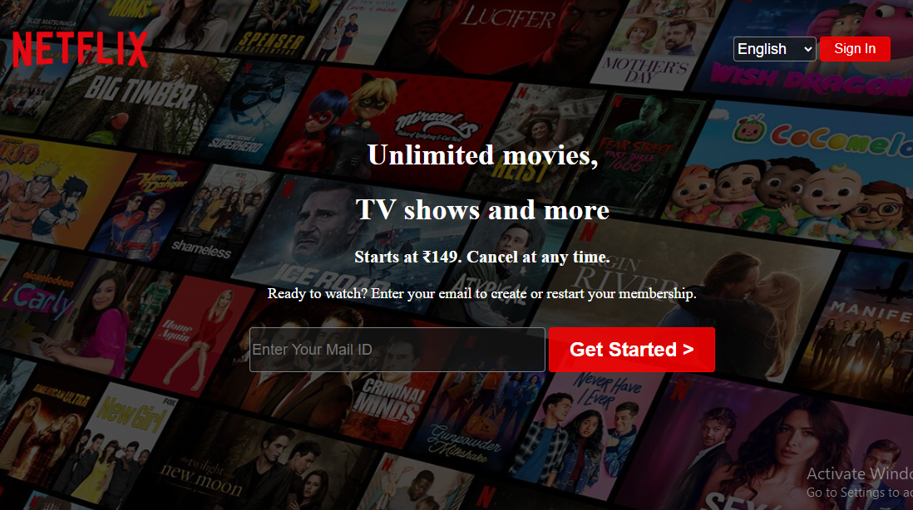

# 🎬 Netflix Landing Page Clone

A static clone of the **Netflix India landing page**, built using **HTML and CSS** to closely replicate the original UI.  
This project is designed to practice layout design, background images, and styling — inspired by Netflix’s modern, cinematic branding.

> 📌 Note: This is a static, **non-responsive** clone created for educational purposes.

---

## 💡 Features

- 🎞️ Full-screen background with movie grid visuals
- 🟥 Netflix logo and UI elements styled as per the original design
- 📩 Email capture form with “Get Started” CTA
- 🔐 Sign In button
- 🌐 Language selector dropdown
- 🧠 Typography and layout cloned to match Netflix look

---

## 🧰 Tech Stack

- HTML5  
- CSS3  

---

## 📸 Screenshot



---

## 🚧 Future Improvements

- Make layout **fully responsive** for all screen sizes
- Add **JavaScript** validation and interaction
- Connect backend for form submission and authentication
- Include signup / login modals

---

## 📦 How to Run Locally

```bash
1. Clone the repository:
   git clone https://github.com/Deeps1970/netflix-clone.git

2. Navigate into the project directory:
   cd netflix-clone

3. Open index.html in your browser.
```

## 📬 Contact
📧 Email: thiagarajandeepu2007@gmail.com
📞 Phone: +91 63832 63688
🌍 Portfolio: [Click Here!](https://deeps1970.github.io/Deeps1970/)

❤️ Credits
This is a personal project built by Deepak B T for educational purposes only.
Netflix™ is a registered trademark of Netflix, Inc. This project is not affiliated with or endorsed by Netflix.
